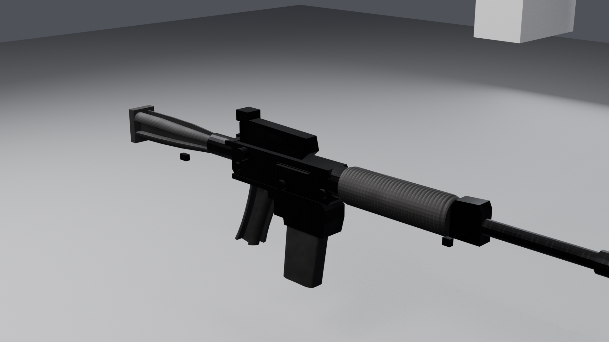

# AR-15 3D Model

A game-ready 3D prop created in Blender with Claude Opus 5.5. The repository includes the editable Blender source, engine-friendly exports, textures, and rendered previews.

> This is a visual, non-functional digital prop. It contains no usable internal mechanism, bore, chamber, or manufacturing instructions.

## Downloads

- `Opus5.5AR-15.blend` — editable Blender source with the model, materials, UVs, LODs, animation clips, cameras, and studio setup.
- `Exports/AR15_Game.glb` — glTF 2.0 binary export with packed textures and five animation clips.
- `Exports/AR15_Game.fbx` — FBX export with portable relative texture references.
- `Textures/` — PNG texture sets.
- `Previews/` — final presentation renders.

## Asset overview

- Blender version: 5.2 or newer recommended
- Units: metres
- Authoring axes: +Y forward, +Z up, +X to the model's right
- Overall length: 0.871 m
- Main export: 32 mesh objects, 10 materials, 7 packed images
- LOD triangle counts: 9,872 / 4,484 / 2,144
- Texture families: metal, polymer, and rubber
- Texture resolution: up to 2048 × 2048

## Animation clips

- `Idle_Inspect`
- `Fire_SingleShot`
- `MagChange_Loaded`
- `MagChange_Empty`
- `Stock_Adjust`

The animations are intended for game-state presentation. They do not simulate a functional mechanism.

## Opening the source

1. Open `Opus5.5AR-15.blend` in Blender 5.2 or newer.
2. Use the `AR15_Game` collection for the main asset.
3. Use `AR15_LOD_LOD1` and `AR15_LOD_LOD2` for the lower-detail versions.
4. Use `AR15_Studio` for the included cameras and presentation lighting.

The public source uses relative texture and render paths, so it can be moved or cloned without exposing the original workstation layout.

## Import notes

- The GLB follows the glTF 2.0 Y-up convention.
- The FBX export is Y-up with -Z forward.
- Roughness/metallic textures use the glTF channel layout: green = roughness, blue = metallic.
- The normal map uses the OpenGL/+Y convention. Invert the green channel in pipelines that expect DirectX/-Y normals.

## Included preview renders

- Left and right views
- Three-quarter view
- Top view
- Receiver close-up
- First-person view
- Wireframe view

Created as a public 3D asset project. No real serial number, logo, or brand wordmark is reproduced.
