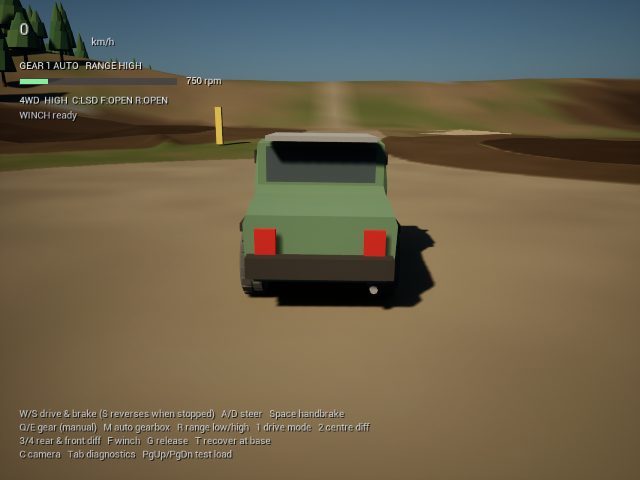

# Mudtrack



Небольшая off-road игра на Unreal Engine 5.8: полноприводный автомобиль,
работающая подвеска, трансмиссия и деформируемый грунт с сохраняющимися колеями.

## Быстрый запуск на Windows

Unreal Engine и инструменты разработчика для игры **не нужны**.

### Способ 1 — готовая сборка

1. Откройте [релиз Mudtrack v1.0.0](https://github.com/Prokopiy8247/Opus5.5-4-projects/releases/tag/mudtrack-v1.0.0).
2. Скачайте `Mudtrack-Windows-x64.zip`.
3. Полностью распакуйте архив в любую папку.
4. Дважды нажмите `START_GAME.bat` (или `Mudtrack.exe`).

### Способ 2 — один файл запуска

Скачайте репозиторий через **Code → Download ZIP**, распакуйте его и дважды
нажмите `START_GAME.bat` (или `PLAY_MUDTRACK.bat`). Скрипт сам скачает готовую сборку и
запустит игру. При первом запуске потребуется интернет и около 1 ГБ свободного
места.

Сборка не подписана коммерческим сертификатом, поэтому Windows SmartScreen может
показать предупреждение. Проверяйте, что файл скачан именно из раздела Releases
этого репозитория.

## Управление

| Клавиша | Действие |
|---|---|
| `W` / `S` | Газ / тормоз / задний ход после остановки |
| `A` / `D` | Поворот |
| `Space` | Ручной тормоз |
| `Q` / `E` | Передача вверх / вниз |
| `M` | Автоматическая / ручная коробка |
| `R` | Пониженный / повышенный ряд |
| `1` | 4WD / задний привод / передний привод |
| `2`, `3`, `4` | Центральный, задний и передний дифференциалы |
| `F` / `G` | Лебёдка / отпустить лебёдку |
| `T` | Вернуть машину на старт |
| `C` | Сменить камеру |
| `Tab` | Диагностика физики |
| `PgUp` / `PgDn` | Добавить / убрать тестовый груз 250 кг |

Поддерживается геймпад; основные подсказки также показаны в HUD.

## Запуск исходного проекта

Понадобятся Unreal Engine 5.8.x и C++ toolchain для Windows (Visual Studio с
компонентом **Game development with C++**). Откройте `Mudtrack.uproject` и
разрешите Unreal пересобрать модули, затем нажмите **Play**.

Для создания собственной Windows-сборки:

```powershell
powershell -ExecutionPolicy Bypass -File .\Scripts\package_mudtrack.ps1 `
  -Configuration Shipping -CleanCook
```

Если Unreal установлен не через Epic Games Launcher или не обнаружился
автоматически, добавьте параметр `-EngineRoot "D:\Epic Games\UE_5.8"`.

## Что внутри

- `Source/Mudtrack/Soil` — модель грунта, деформация и колеи.
- `Source/Mudtrack/Vehicle` — подвеска, шины, двигатель, коробка и дифференциалы.
- `Source/Mudtrack/World` — процедурная трасса и окружение.
- `Source/Mudtrack/Tests` — 10 автоматизированных сценариев физики.
- `Content/Mudtrack` — карта, Blueprint, модели и материалы.
- `UnrealOpus5.5Mudtrack.blend` — исходная Blender-сцена автомобиля.

Из публичной версии намеренно исключены кэши Unreal/Visual Studio, логи,
crash dump'ы, отладочные символы, локальные пути и другие привязанные к машине
файлы. Готовая Windows-сборка хранится в Releases, а не в истории Git.
