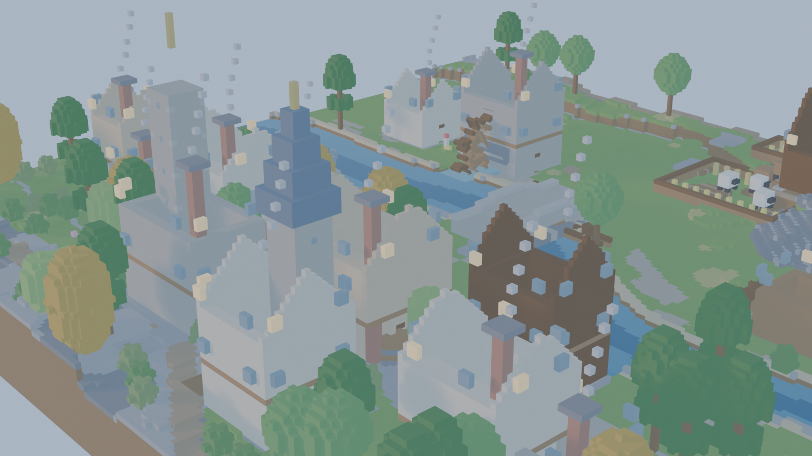
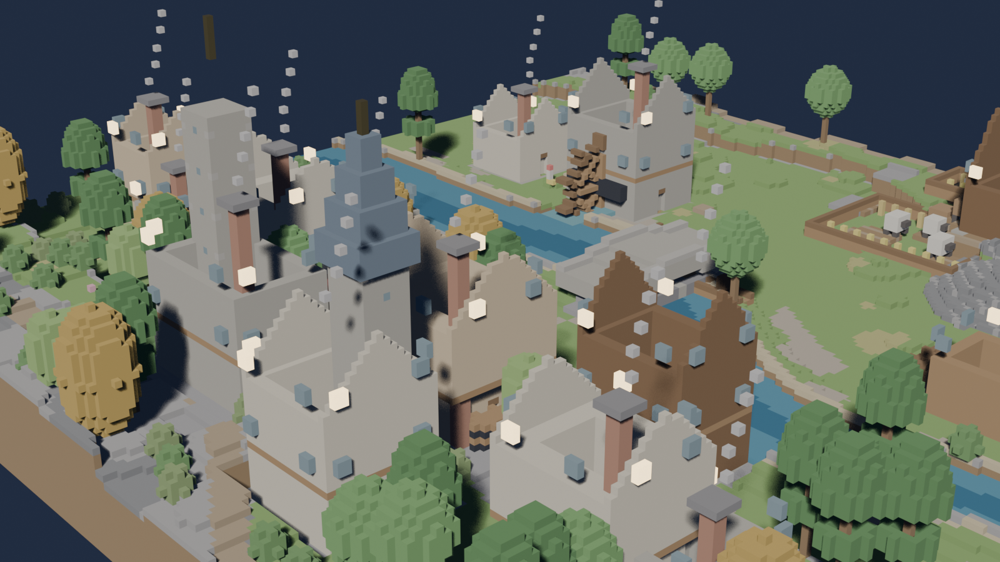

# Voxel Village 3D Model

**Hollowbrook** — детализированная воксельная деревня, созданная в Blender при помощи Claude Opus 5.5. Это законченная 3D-сцена: её можно изучать и редактировать в Blender, импортировать в совместимые 3D-приложения как GLB или пересобрать из Python-генератора.

## Что внутри

- территория размером 96 × 96 м с рекой, мостом, террасами, дорогами и полями;
- 14 зданий, включая ратушу, часовню, водяную мельницу, кузницу и рынок;
- жители, животные, растительность и более 20 типов небольших объектов;
- 240 кадров анимации: колесо мельницы, вода, дым, свет окон и круговой пролёт камеры;
- процедурные материалы без внешних текстур и библиотек;
- оптимизированный GLB: 12 мешей, 52 130 треугольников и 58 материалов.

## Файлы

| Путь | Назначение |
|---|---|
| `Model/VoxelVillage.blend` | редактируемая мастер-сцена для Blender 5.2+ |
| `Model/VoxelVillage.glb` | переносимая glTF 2.0-модель |
| `Images/` | 11 финальных дневных, вечерних и детальных рендеров |
| `Source/generate_voxel_village.py` | самодостаточный генератор сцены |
| `Docs/SCENE_GUIDE.md` | камеры, структура коллекций, анимация и ограничения |
| `Docs/FEATURE_MATRIX.md` | проверенная матрица возможностей проекта |

## Как открыть

1. Установите Blender 5.2 или новее.
2. Откройте `Model/VoxelVillage.blend`.
3. Нажмите `Numpad 0`, чтобы перейти к активной камере.
4. Используйте кадры 1–115 для дневного освещения и 116–240 для вечернего.

Для других редакторов и движков импортируйте `Model/VoxelVillage.glb`. В GLB переносится геометрия, материалы и анимация колеса мельницы; анимация материалов Blender в формат glTF не экспортируется.

## Пересборка из исходника

Откройте `Source/generate_voxel_village.py` в рабочем пространстве **Scripting** чистой сцены Blender и нажмите **Run Script**. Генератор детерминирован и использует только встроенные модули Blender/Python.

## Происхождение ассетов

Все меши и материалы созданы процедурно специально для этой сцены. Сторонние модели, текстуры и звуки не использовались.

Публичная сборка очищена от локальных путей, журналов сессии, benchmark-телеметрии, резервных копий, кэшей и промежуточных рендеров.

